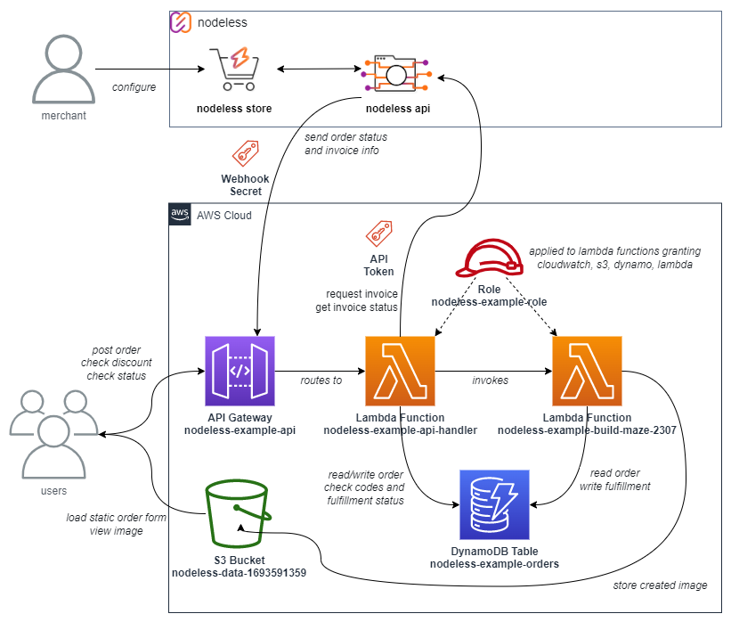

# Nodeless.io and AWS Serverless Example
_An example of integrating AWS Serverless with Nodeless.io and accepting payments_

by @vicariousdrama

805752-805826

---

# Summary

This howto will walk you through the steps of setting up a serverless setup in AWS Cloud that uses nodeless as a payment processor.  Within nodeless, you'll configure the store, a webhook for events, and API token.  Within AWS Cloud, an API Gateway will act as the primary _front door_ to API calls for the user orders, as well as webhooks from nodeless. A general Lambda function will handle the routes from the API Gateway, and a specialized one will serve as an example of an invocation to build a product after the invoice has been paid. A DyanmoDB Table is used as a basic data store for meta information, while files created are placed in an S3 bucket given public access for reading.



---

The steps at a high level

1. [Register/Login to Nodeless.io](#nodelessio)
2. [Register/Login to Setup AWS.com account](#amazon-web-services)
3. [Nodeless: Setup Withdraw Settings](#nodeless-setup-withdraw-settings)
4. [Nodeless: Create Store](#nodeless-create-store)
5. [Nodeless: Create API Token](#nodeless-create-api-token)
6. [AWS: Create API Gateway for Access](#aws-create-api-gateway)
7. [Nodeless: Create Webhook](#nodeless-create-webhook)
8. [AWS: Create s3 Bucket](#aws-create-s3-bucket)
9. [AWS: Create Dynamo Table](#aws-create-dynamo-table)
10. [AWS: Create Identity and Access Management Policy and Role](#aws-create-identity-and-access-management-policy-and-role)
11. [AWS: Create Lambda for Nodeless Webhook and Order Processing](#aws-create-lambda-for-nodeless-webhook-and-order-processing)
12. [AWS: Create Lambda for Building Order](#aws-create-lambda-for-building-order)
13. [AWS: Edit API Gateway for Access](#aws-edit-api-gateway-for-access)
14. [Modify Order Form with Endpoint](#modify-order-form-with-endpoint)
15. [AWS: Upload Static Order Form Page to Bucket](#aws-upload-static-order-form-page-to-bucket)

---

# Nodeless.io

Nodeless lets you accept bitcoin and lightning payments without needing to setup the server infrastructure. You don't need to run your own node, or establish your own server payemnt provider. Instead, you can create an account with Nodeless and have it route finalized payments to lightning address or on chain address.  It works very well with custodial providers for the Bitcoin circular economy.

If you haven't already done so, [sign up for an account](https://nodeless.io/app/signup) with a dedicated email and password. Or, [login](https://nodeless.io/app/login) to your dashboard

# Amazon Web Services

Amazon Web Services have been around for nearly two decades and is a leader in serverless technology.  This example will make use of API Gateway, DynamoDB, Lambda Functions and an s3 Bucket.

If you haven't already done so, [create an account](https://portal.aws.amazon.com/gp/aws/developer/registration/index.html) or [login](https://console.aws.amazon.com/console/home) to the console.

# Nodeless: Setup Withdraw Settings

From the Administration submenu on the left, choose `Withdraw`.  Then pick the Withdraw Settings.

Modify the settings on this page as appropriate to setup your Lightning Address and an On-chain Address. I recommend the Lightning Address as teh default payment method.

# Nodeless: Create Store

If you don't have an existing Nodeless Store, you can add a new one by clicking `Store` from the Payment submenu on the left, then the `Add Store` button in the upper right. Provide a name for the store.

Once you have a store you plan to use, make note of its ID.  This is the UUID looking identifier in the address bar, and a convenient copy button is provided next to the store name.

In this example, my store name is `test-store`, and the ID is `d809bb04-bb3a-4d84-8f75-eba51397e88a`. The copy link shows the first few characters


We will come back to this later to setup the webbook after defining the API Gateway for Access in AWS.

# Nodeless: Create API Token

From within Nodeless, click on your `Profile` from the App menu on the left, or from the dropdown on your email address in the upper right corner.

Next, select the `API Tokens` submenu on the Settings page of profile.

Click the button to `Generate Keys` and provide a label.  For this example, I just put `nodeless-example-apikey`

The API token value will be displayed. This is the only time it is displayed. You should save this to some place you can access it later. You will need it when continuing setup with the AWS Lambda function.

# AWS: Create API Gateway for Access

You can think of an API Gateway as a basic contract or schematic of operations allowed to your backend service from the internet. It provides for an endpoint that can be called, and permits routing operations to handlers.

In the AWS Console, access the [API Gateway](https://us-east-1.console.aws.amazon.com/apigateway/main/apis?region=us-east-1).

Click the [Create API](https://us-east-1.console.aws.amazon.com/apigateway/main/precreate?region=us-east-1) button in upper right corner.

For this example, choose the simple HTTP API option.

On step one, specify a name for the api.  You can name it whatever you want to fit your nomenclature.  If you can't think of a name, use something simple like `nodeless-example-api`

For steps 2 through 4, click next and eventually create. This will create an empty API without any routes defined yet. We will come back to this later and fill them in.

Once created, you'll be looking at the details for the API, and you'll see an Invoke URL. This url is what will be referenced externally. You'll need it for both the Nodeless webhook, and the static HTML page for where user inputs should be sent to

For example, the Invoke URL that was created for my API is https://eahilxrhrg.execute-api.us-east-1.amazonaws.com

# Nodeless: Create Webhook

Back in Nodeless, navigate to the store page you had setup.  On the submenu that appears, you can choose `Webhooks`

Click the `New Webhook` action on the right side.

In the URL field, specify the value of the Invoke URL from the API Gateway, with the path appended as `/nodeless`. 

For example, my Invoke URL was `https://eahilxrhrg.execute-api.us-east-1.amazonaws.com`.

The URL I specify is `https://eahilxrhrg.execute-api.us-east-1.amazonaws.com/nodeless`

Make note of the generated Secret value.  You'll need to capture this and use in configuration later to properly validate signed messages sent from Nodeless to the webhook endpoint.

Choose these events
- Invoice Created
- Invoice Paid
- Invoice Expired

Click the `Save` button when complete.

At this point, you've setup everything needed on the Nodeless side, and you'll only need to come back to Nodeless to debug or trace orders.

# AWS: Create s3 Bucket

The simple storage solution (s3) is where resulting products will be saved when generated, and permissions setup to allow accessing them over the web.

In the AWS Console, access [Amazon S3](https://s3.console.aws.amazon.com/s3/home?region=us-east-1#).

Click the [Create bucket](https://s3.console.aws.amazon.com/s3/bucket/create?region=us-east-1) button in the upper right corner.

You'll need to provide a bucket name.  The name itself doesn't matter but must be unique in the global namespace.  The global namespace is shared across all AWS accounts (nuts, I know, but S3 is like the granddaddy of serverless and they weren't considering namespaces at that time).  In the example below, I use the bucket name `nodeless-data-1693591359`, but you can just as easily use any bucket name, as long as its consistent. I do recommend logical naming, so perhaps you will go with `nodeless-data-` followed by numbers as a suffix. You could use your AWS account number, or the [Unix Epoch Time](https://www.epochconverter.com/). Whatever it takes to still be meaningful and unique.

Configure it as a public access bucket by **unchecking** the box labeled `Block all public access`, and also check the box below to acknowledge those settings might result in the bucket and objects within becoming public.


Leave the rest of the settings default and click `Create bucket` button at the bottom of the page.

On the [Amazon S3 Buckets page](https://s3.console.aws.amazon.com/s3/buckets?region=us-east-1&region=us-east-1), click your newly created bucket.  Then navigate to the `Permissions` view.  Edit the Bucket Policy to look like the following, replacing the name of your s3 bucket where it has `nodeless-data-1693591359` in the resource value.

```json
{
    "Version": "2008-10-17",
    "Statement": [
        {
            "Sid": "PublicReadGetObject",
            "Effect": "Allow",
            "Principal": {
                "AWS": "*"
            },
            "Action": "s3:GetObject",
            "Resource": "arn:aws:s3:::nodeless-data-1693591359/*"
        }
    ]
}
```

# AWS: Create Dynamo Table

In the AWS Console, access the [DynamoDB Tables](https://us-east-1.console.aws.amazon.com/dynamodbv2/home?region=us-east-1#tables).

Click the [Create Table](https://us-east-1.console.aws.amazon.com/dynamodbv2/home?region=us-east-1#create-table) button in the upper right corner.

For the table name, indicate the name that will be referenced by the lambda functions we will create later. For example `nodeless-example-orders`

For the partition key, specify `id`

Leave the rest of the data defaulted and click `Create table` at the bottom.

# AWS: Create Identity and Access Management Policy and Role

Now we'll define a custom IAM role for use by the Lambda functions that will be created later.  This will have appropriate permissions for writing logs to cloudwatch, the necessary permissions for the DynamoDB table, and access to the S3 Bucket.

In the AWS Console, access the [Identity and Access (IAM)](https://us-east-1.console.aws.amazon.com/iamv2/home#/roles) roles.

Click the [Create role](https://us-east-1.console.aws.amazon.com/iamv2/home#/roles/create?step=selectEntities) button in the upper right corner.

For `Trusted entity type`, continue with the default `AWS service` and pick Lambda from the Use Case. Click `Next`.

On the `Add permissions` page, click `Create policy`.  This will open a new tab for specifying teh permissions. On the `Specify Permissions` tab, change the policy editor from Visual to `JSON` by clicking the appropriate button in upper right corner.  Then paste in the following.  You'll need to change the resource ARN values for the s3 Bucket to match your bucket name

```json
{
    "Version": "2012-10-17",
    "Statement": [
        {
            "Effect": "Allow",
            "Action": "logs:CreateLogGroup",
            "Resource": "arn:aws:logs:us-east-1::*"
        },
        {
            "Effect": "Allow",
            "Action": [
                "logs:CreateLogStream",
                "logs:PutLogEvents"
            ],
            "Resource": [
                "arn:aws:logs:::log-group:/aws/lambda/nodeless-example-api-handler:*",
                "arn:aws:logs:::log-group:/aws/lambda/nodeless-example-build-maze-2307:*"
            ]
        },        
        {
            "Effect": "Allow",
            "Action": [
                "lambda:InvokeFunction"
            ],
            "Resource": [
                "*"
            ]
        },
        {
            "Effect": "Allow",
            "Action": [
                "dynamodb:DeleteItem",
                "dynamodb:GetItem",
                "dynamodb:PutItem",
                "dynamodb:Scan",
                "dynamodb:UpdateItem"
            ],
            "Resource": "arn:aws:dynamodb:*:*:table/nodeless-example-orders"
        },
        {
            "Effect": "Allow",
            "Action": [
                "s3:GetBucketPolicyStatus",
                "s3:GetBucketObjectLockConfiguration",
                "s3:GetEncryptionConfiguration",
                "s3:ListBucket",
                "s3:GetBucketVersioning"
            ],
            "Resource": "arn:aws:s3:::nodeless-data-1693591359"
        },
        {
            "Effect": "Allow",
            "Action": "s3:ListAllMyBuckets",
            "Resource": "*"
        },
        {
            "Effect": "Allow",
            "Action": [
                "s3:DeleteObjectTagging",
                "s3:PutObject",
                "s3:GetObjectAcl",
                "s3:GetObject",
                "s3:DeleteObjectVersion",
                "s3:GetObjectVersionTagging",
                "s3:GetObjectVersionAcl",
                "s3:GetObjectTagging",
                "s3:PutObjectTagging",
                "s3:DeleteObject",
                "s3:PutObjectAcl",
                "s3:GetObjectVersion"
            ],
            "Resource": "arn:aws:s3:::nodeless-data-1693591359/*"
        }        
    ]
}
```
Click the `Next` button at the bottom right of the page. 

Enter a name for the policy `nodeless-example-policy`. Click `Create policy` at the bottom right of the page. This tab can be closed once returned to the policy list.

Return to the page where creating the role. Refresh the list of policies. Check the box for `nodeless-example-policy` and then click `Next`.  Name the role `nodeless-example-role` and click `Create role`

# AWS: Create Lambda for Nodeless Webhook and Order Processing

This is the main lambda used for calls from users for placing orders, and for interfacing with Nodeless.

In the AWS Console, access the [AWS Lambda Functions](https://us-east-1.console.aws.amazon.com/lambda/home?region=us-east-1#/functions).

Click the [Create Function](https://us-east-1.console.aws.amazon.com/lambda/home?region=us-east-1#/create/function) button in the upper right corner.

Lambda functions have a variety of parameters possible. For now, choose a suitable function name. This example assumes the name `nodeless-example-api-handler`. Keep the Runtime of `Node.js 18.x` and Architecture set to `x86_64`.  

Click on the `Change default execution role` option, select `Use an existing role`. Specify the role name created above `nodeless-example-role`

Click the `Create function` button.

Replace the existing contents of `index.mjs` with that from [nodeless-example/index.mjs](./nodeless-example/index.mjs)

Once pasted, click the "Deploy" button in the menu bar

Thats a fairly lengthy file. Here's a summary of each function's purpose:

- makeId(timestamp) - converts a unix epoch time to words from the bip39 word list, reversed, and hyphenated
- getOverageBySize(metadata) - For image products, a trivial formula for paying based on resulting size and computation
- calcAmount(baseAmount, metadata, discount) - Based on the product type being ordered, the total can be increased based on order info
- makeInvoice(satsAmount, orderId) - Calls nodeless.io to create an invoice for the given amount
- getNodelessInvoice(id) - Using the nodeless invoice id, lookup the status of the invoice
- getValueCodeDiscount(code) - If a discount code was given, this function will determine if its valid (and not expired) and returns the discount amount to apply
- invokeBuilder(orderItem) - once an order has been paid for, this function calls a separate lambda to build the product in the background. There is hardcoding here that maps a product type `MAZE2307` to a function `nodeless-example-build-maze-2307` that could be made more dynamic by lookup in dynamo table or other resource, but for simplicity is retained structured in the example

Following functions you'll see two constants

- export const handler - This is the entry point into the lambda and from which the functions above are called along with the intended API spec
- b39 - This is the bip39 word list, delimited by spaces, then split into a list for reference by the makeId function

## Configuration for Lambda

After saving the code for the lambda function. Click the `Configuration` tab. 

### General Configuration

Switch to the `General Configuration` tab.  Click `Edit`, and set memory to 128 MB and the Timeout to 5 seconds. Click `Save` to apply the changes.

### Permissions

Switch to the `Permissions` tab from the menu on the left.

Verify that the resource summary shows that the role chosen has access to Lambda, CloudWatch Logs, DynamoDB and S3


### Environment Variables

Switch to the `Environment Variables` tab from the menu on the left.

This lambda function expects 5 environment variables to be setup as follows:

- dynamoTable - The name of the dynamo table created previously for this example (e.g. nodeless-example-orders)
- nodelessApiKey - The API Token you received from Nodeless.io
- nodelessStoreId - The store id for your store at Nodeless.io
- nodelessWebookSecret - The Webhook secret for your store at Nodeless.io
- valueCodes - For no discounts, just define as an empty string.  If you want to give discounts, then each discount code is comma delimted, and for each code configuration is colon delimited.  For example the value `CODE1:1000,CODE2:2000:1696118400,HoneyBadger:2100` defines three codes (CODE1, CODE2 and HoneyBadger), where the first gives a discount of 1000, the second 2000 and the third 2100. The third argument on the second discount is an expiry time as defined in unix timestamp in seconds

Yes, I'm aware there are other ways to abstract out secrets such as the AWS Secrets Manager. For simplicity and reducing number of services needing to setup for this example they've been kept local.

## Test Settings

Click the `Test` tab at the top.  We'll setup some test events to verify things are working as expected.

### test-post-codes

Click `Create new event`. For event name, specify `test-post-codes`.  In the Event JSON block, paste the following: 

```json
{
  "routeKey": "POST /codes",
  "body": "{\"vcode\":\"CODE1\"}"
}
```

Click `Save`, then `Test`. If you had defined the valueCodes environment variable to include CODE1, as sampled above, you'll see a response like the following


### test-post-orders

Click `Create new event`. For event name, specify `test-post-orders`. In the Event JSON block, paste the following:

```json
{
  "routeKey": "POST /orders",
  "body": "{\"metadata\":{\"bitcoin\":{\"blockheight\":805752},\"height\":1080,\"width\":1920,\"seedtype\":\"blockheight\",\"type\":\"MAZE2307\"},\"discount\":{\"vcode\":\"CODE1\"}}"
}
```

Click `Save`, then `Test`. If you had defined the valueCodes environment variable to include CODE1, as sampled above, you'll see a much more lengthier response that includes an id indicating and ORDER number, status, satsAmount, storeInvoiceId and others if able to communicate with Nodeless.  This will have a lighthingInvoice, qrCode and more.


Make note of the ORDER value to use for the next test. In my test run the order number was `ORDER-RAOBIV-ICLI-ASUORG`

### test-get-order

Click `Create new event`. For event name, specify `test-get-order`. In the Event JSON block, paste the following:

Replace the id value to match that from the response of the order post

```json
{
  "routeKey": "GET /orders/{id}",
  "pathParameters": {
    "id": "ORDER-RAOBIV-ICLI-ASUORG"
  }
}
```

Click `Save`, then `Test`.


The response body indicates a status (s) of new (n).

### test-get-order-detailed

Click `Create new event`. For event name, specify `test-get-order-detailed`. In the Event JSON block, paste the following:

Replace the id value to match that from the response of the order post

```json
{
  "routeKey": "GET /orders/{id}/detailed",
  "pathParameters": {
    "id": "ORDER-RAOBIV-ICLI-ASUORG"
  }
}
```

Click `Save`, then `Test`.  The full details for the order will be returned similar to that returned when posting the order.

# AWS: Create Lambda for Building Order

The previous lambda is somewhat general purpose to facilitate order placement.  This lambda is focused on work for the MAZE2307 product type mapped to a function named nodeless-example-build-maze-2307.  

Another point of interest about this lambda, is that we'll be using a different runtime, accompanied by custom layers.  This sample leverages code from the [Nodeyez codebase](https://github.com/vicariousdrama/nodeyez), and as such requires using Python, and having available some key packages that do not come with the Python runtime by default.

In the AWS Console, access the [AWS Lambda Functions](https://us-east-1.console.aws.amazon.com/lambda/home?region=us-east-1#/functions).

Click the [Create Function](https://us-east-1.console.aws.amazon.com/lambda/home?region=us-east-1#/create/function) button in the upper right corner.

For function name, specify `nodeless-example-build-maze-2307`. This should match the value referenced by the invokeBuilder function in the nodeless-example-api-handler Lambda function and the nodeless-example-policy IAM policy.

For Runtime, choose Python 3.10 from Other Supported. And keep x86_64 as the architecture.

Click on the `Change default execution role` option, select `Use an existing role`. Specify the role name created above `nodeless-example-role`

Click the `Create function` button.

Download this zip file: [nodeless-example/build-maze-2307.zip](./nodeless-example/build-maze-2307.zip)

On the Code Source view, in the upper right corner, choose `Upload from` and pick `.zip file`.  Choose the build-maze-2307.zip and click the `Save` button


In the file tree to the left, you should see a series of folders and the replaced lambda_function.py.  The folders for config, data, imageoutput, and mock-data are supposed to be empty. Some of the python files in the scripts folder attempt to read from them or want to write to them and expect them to exist.  The scripts folder is a modified version of the similarly named files from the Nodeyez project. The images folder contains just the files needed for the maze production.

## Adding Layers

We will need to add layers for Pillow, numpy, requests, and boto3.  

For each of these, click Add a layer.  Then choose `Specify an ARN`, and provide the necessary ARN before clicking Add.

- arn:aws:lambda:us-east-1:770693421928:layer:Klayers-p310-Pillow:2
- arn:aws:lambda:us-east-1:770693421928:layer:Klayers-p310-numpy:2
- arn:aws:lambda:us-east-1:770693421928:layer:Klayers-p310-requests:3
- arn:aws:lambda:us-east-1:770693421928:layer:Klayers-p310-boto3:3

## Configuration for Lambda

After saving the code for the lambda function. Click the `Configuration` tab. 

### General Configuration

Switch to the `General Configuration` tab.  Click `Edit`, and set memory to 256 MB and the Timeout to 30 seconds. Click `Save` to apply the changes.

### Environment Variables

If not already presented with the environment variables, choose `Environment Variables` from the menu on the left.

This lambda function expects 5 environment variables to be setup as follows:

- dynamoTable - The name of the dynamo table created previously for this example (e.g. nodeless-example-orders)
- s3Bucket - The name of the s3 bucket previously established for storing the output (e.g. nodeless-data-1693591359)

## Test Settings

Click the `Test` tab at the top.  We'll setup some test events to verify things are working as expected.

### test-build-order

Click `Create new event`. For event name, specify `test-build-order`. In the Event JSON block, paste the following:

Replace the id value to match that from the response of the order post

```json
{
  "orderId": "ORDER-RAOBIV-ICLI-ASUORG"
}
```

Click `Save`.

Before running the `Test`, you'll need to open a tab to [navigate to the DynamoDB Tables](https://us-east-1.console.aws.amazon.com/dynamodbv2/home?region=us-east-1#item-explorer), [choose the respective table](https://us-east-1.console.aws.amazon.com/dynamodbv2/home?region=us-east-1#item-explorer?table=nodeless-example-orders), locate the order in the dynamo table, and change the invoice status from `pending` to `paid`.  

You can use the filters to search for a specific item as follows


Click the link to edit the item, and then expand the invoice attribute to reveal its nested fields. Set the status to `paid`.  If you've previously run this order, you may need to also expand `fulfillment` and set status to `pending`.  After making changes, click the `Save changes` button at the bottom of the page, and then return to the test.

Click the `Test` button to run the test. If it was built successfully, you'll see a response like the following


# AWS: Edit API Gateway for Access

In the AWS Console, access the [API Gateway](https://us-east-1.console.aws.amazon.com/apigateway/main/apis?region=us-east-1).

Click on the API for `nodeless-example-api` or whatever name you chose when initially creating the API endpoint.

## Define Routes

Click `Routes` from the menu on the left.

Click `Create` for each route below

| Method | Path |
| --- | --- |
| GET | /orders/{id} |
| GET | /orders/{id}/detailed |
| OPTIONS | / |
| POST | /codes |
| POST | /nodeless |
| POST | /orders |

The tree should look like the following


## Establish Integration

Click `Integrations` from the menu on the left.  You'll see the same type of tree as depicted for routes.  

Click the `Manage Integrations` option on the submenu at the top.

Click `Create`.  You can ignore the option to `Attach this integration to a route` at this time. For `Integration target`, choose `Lambda function`.  In the Lambda function search box, select or type in the name of the Lambda function for the Nodeless Webhook and Order Processing. As created above, this is the one named `nodeless-example-api-handler`.  Leave the defaults in advanced settings, as well as for invoke permissions. This will establish roles needed to grant permissions.  Click the `Create` button in the bottom right of the page.  

On the Integrations view, choose the `Attach integrations to routes` submenu at the top.

For each of the six operations, select the route, and choose the integration in the dropdown and click `Attach integration`.

This `AWS Lambda` tag will present itself in the tree of routes for those routes that have an integration


## Test the API

Open a web browser, and try to set retrieving details about an order using the endpoint and adding the path.  

This example has an API Gateway endpoint of `https://eahilxrhrg.execute-api.us-east-1.amazonaws.com`.  The order ID I want to use is `ORDER-RAOBIV-ICLI-ASUORG`.

The full URL is `https://eahilxrhrg.execute-api.us-east-1.amazonaws.com/orders/ORDER-RAOBIV-ICLI-ASUORG/detailed`

When pasting that URL into the browser, I get back the JSON of the order details.  At the end there is the `fulfillment` attribute with a nested field of the `url` if it was built that can also be accessed to download the image created.

If you retrieve the order without the detailed endpoint using the url `https://eahilxrhrg.execute-api.us-east-1.amazonaws.com/orders/ORDER-RAOBIV-ICLI-ASUORG`, the response will be much shorter, revealing only the essential information.  In this case

```json
{
  "s":"e",
  "fs":"d",
  "fu":"https://nodeless-data-1693591359.s3.amazonaws.com/orders/maze2307/ORDER-RAOBIV-ICLI-ASUORG.png"
}
```

- s : the overall status. `e` here denotes `expired` as the invoice timed out
- fs : the fulfillment status. `d` in this instance denotes `done`
- fu : the fulfillment url. 

Other operations can be tested using curl

# Modify Order Form with Endpoint

Download this html file: [nodeless-example/maze.html](./nodeless-example/maze.html)

In a text editor, open the file and locate the line that sets the value for `apiBaseUrl`.  For context, this is line 194 and looks like the following


Modify the value to reflect the endpoint for the API Gateway.  For the example created above, I would set this to `https://eahilxrhrg.execute-api.us-east-1.amazonaws.com/`

Save the file.

# AWS: Upload Static Order Form Page to Bucket

In the AWS Console, access [Amazon S3](https://s3.console.aws.amazon.com/s3/home?region=us-east-1#).

Traverse into the bucket you've created.  In this example it is `nodeless-data-1693591359`, but yours will be something different.

Click the `Upload` button. Then choose `Add files`. Select your modified `maze.html` file from the previous section.

Click the `Upload` button to complete the upload.

Click the file in the bucket that was just uploaded to review s3 details.  Locate the `Object URL` on the right side and copy the URL.  Open a new browser tab and paste the URL.

The url should be in the following form

`https://{your-s3-bucket-name}.s3.amazonaws.com/maze.html`

Test the form.  


You should be able to create an order, have an invoice generated with QR Code displayed, pay the invoice and have those sats sent from Nodeless to your configured lightning address.

You may want to modify the html to remove or change the support text and suggested value codes.  
